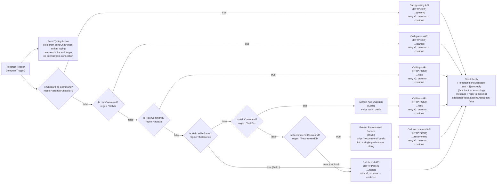

# Board Game Concierge — n8n Workflow Diagram

Visual reference for [board-game-concierge.workflow.json](board-game-concierge.workflow.json). Node names, branches, and connections below mirror the JSON exactly — if you edit the workflow, update this diagram to match.

## Routing logic

| Incoming message | Matches | Route |
|---|---|---|
| `/start`, or bare `/help` (no argument) | `Is Onboarding Command` regex | `GET /greeting` — randomly varied welcome message (see `app/phrasing.py`) |
| `/list` | `Is List Command` regex | `GET /games` — current rulebook library, read live from `PILOT_GAMES_BY_BGG_ID` |
| `/tips` | `Is Tips Command` regex | `POST /tips` — strategy tip for the session's game, via SerpApi (Brave AI Mode), rotated so repeat askers for the same game don't get the same tip |
| `/help <game name>` (e.g. `/help Wingspan`) | `Is Help With Game` regex | `POST /report` directly — same rules digest as the free-text trigger below |
| `/ask <question>` | `Is Ask Command` regex | `Extract Ask Question` → `POST /ask` (uses per-chat session memory on the backend) |
| `/recommend <player count> <preferences>` | `Is Recommend Command` regex | `Extract Recommend Params` → `POST /recommend` (player count extracted server-side from free text; asks for it if missing; no session memory used) |
| Anything else, e.g. *"we're playing Ticket to Ride tonight"* | fallback of all the above | `POST /report` directly with the raw message text |

## Notes

- **Typing indicator**: `Send Typing Action` fires as a parallel dead-end branch straight off `Telegram Trigger` — it does **not** chain in front of the routing `IF` nodes. Chaining it inline would replace `$json` with Telegram's `sendChatAction` API response for every downstream node, breaking every `$json.message.text` regex check in the routing chain. It's a single ~5s indicator (Telegram Bot API limit), not a repeating one, so it can expire before a slow LLM call finishes — expected for v1.
- **`appendAttribution`**: `Send Reply` uses Telegram's `sendMessage` operation, which n8n defaults to appending "This message was sent automatically with n8n" to (`additionalFields.appendAttribution` defaults to `true` when unset, for node version ≥ 1.1). It's explicitly set to `false` here. If another `sendMessage`-operation node is ever added to this workflow, set it there too or the footer silently reappears.
- **Fan-in**: `Send Reply` has six incoming connections (`Call /greeting API`, `Call /games API`, `Call /tips API`, `Call /ask API`, `Call /recommend API`, `Call /report API`) — only one fires per execution, since the `IF` nodes form a mutually exclusive gate chain (`Is Onboarding Command` → `Is List Command` → `Is Tips Command` → `Is Help With Game` → `Is Ask Command` → `Is Recommend Command` → fallback). `Call /report API` itself has two distinct inbound edges (from `Is Help With Game`'s true branch and `Is Recommend Command`'s false/catch-all branch) but is still one node, executed independently per triggering path.
- **chat_id** is always read via a named-node reference back to `Telegram Trigger` (`$('Telegram Trigger').item.json.message.chat.id`), not passed through the branch nodes — keeps every branch's HTTP body construction independent of how many nodes are in between, and immune to the parallel `Send Typing Action` branch's output shape.
- **`/recommend` doesn't require a leading number** — `Extract Recommend Params` just strips the `/recommend ` prefix and passes the rest as a single `preferences` string; the FastAPI backend extracts a player count from that free text itself (best-effort regex) and asks a clarifying question if it can't find one, rather than requiring rigid command syntax.
- **Canned edge-case replies** (unknown game, no session yet, missing player count, no rulebook coverage, no tips found) are randomly picked from a few phrasings each on the backend (`app/phrasing.py`), not hardcoded once in this workflow — so repeat visitors hitting the same edge case don't see the exact same sentence every time.
- **Multi-turn continuations**: the catch-all `POST /report` edge doesn't unconditionally treat free text as a game announcement. `/report` first checks `app/memory.py`'s per-chat pending-intent state (an intent tag plus whatever payload the original request needs to finish, e.g. `/ask`'s question text) - if the chat's real request was blocked on "which game" (`/recommend` needed a player count; `/ask`/`/tips` had no session yet), the incoming free text completes THAT original request instead of being (mis)read as an unrelated game announcement that would otherwise just dump a generic rules digest. E.g. `/ask how do we earn more in Monopoly?` → "which game?" → "we're playing Monopoly" now answers the earn-more question directly, rather than replying with the full report and losing the original question. This is entirely backend logic; no extra n8n nodes were needed since the catch-all already pointed at `/report` - `/report` just got smarter about what "anything else" means.
- **Error handling**: all HTTP Request nodes retry twice (1s apart) and, on final failure, `onError: continueRegularOutput` lets the workflow keep going with an error object instead of halting — `Send Reply`'s text expression falls back to an on-persona apology when `$json.reply` is absent.
- **`Setup Notes`** (a sticky note in the actual workflow) isn't shown here since it carries no data connections — see the JSON file or the n8n canvas for the setup instructions it contains.
